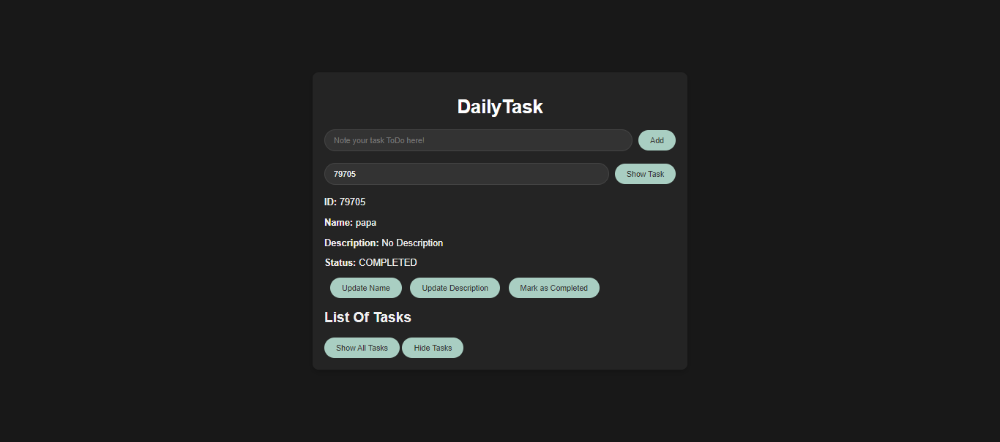
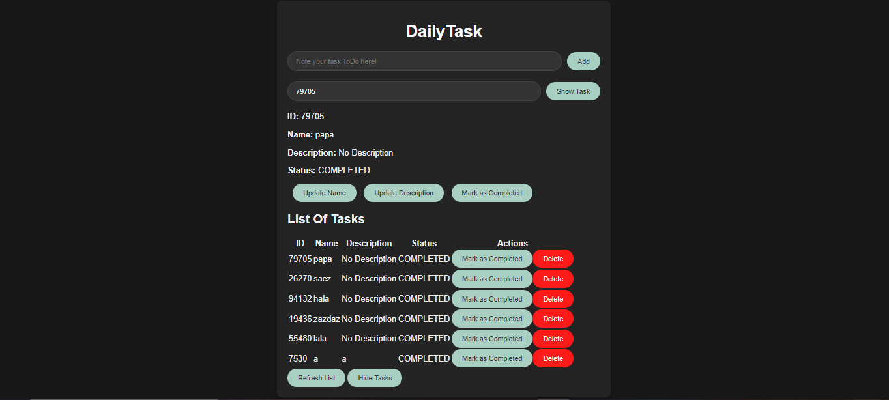

# DailyTask

DailyTask is a robust ToDo application developed using HTML, CSS, and JavaScript for the frontend. The backend leverages AWS services for a serverless architecture, including AWS S3 for hosting static content, AWS DynamoDB for storing tasks, AWS Lambda for function execution, and AWS API Gateway for managing endpoints and connecting Lambda functions with the DynamoDB table.

## Features

- **Add Tasks:** Quickly add tasks with a title and description.
- **Update Tasks:** Edit the title and description of existing tasks.
- **View Tasks:** View all your tasks.
- **Complete Tasks:** Mark tasks as completed.
- **Delete Tasks:** Remove tasks that are no longer needed.

## AWS Architecture

- **Frontend:**
  - **HTML, CSS, JavaScript:** The core technologies for building the user interface.
  - **AWS S3:** Hosts and serves the static content of the application.

- **Backend:**
  - **AWS DynamoDB:** Stores tasks and their characteristics.
  - **AWS Lambda:** Executes the application’s functions using Python.
  - **AWS API Gateway:** Manages the endpoints and connects Lambda functions with the DynamoDB table.
    

## Endpoints

| Method | Endpoint         | Description                                 |
|--------|------------------|---------------------------------------------|
| POST   | /addToDo         | Add a new ToDo to the table                 |
| GET    | /getToDo         | Retrieve a specific ToDo and its information|
| GET    | /getAllToDo      | List all ToDos                              |
| PUT    | /updateToDo      | Modify an existing ToDo                     |
| PUT    | /completeToDo    | Mark a ToDo as completed                    |
| DELETE | /deleteToDo      | Delete a ToDo                               |

## Learning Outcomes

Developing DailyTask was an excellent practice in using AWS services. It provided hands-on experience with serverless applications and event-driven architecture, enhancing my understanding of these technologies.

## Usage

Heberged application link:

[DailyTask Application](http://todoapp-imad.s3-website-us-east-1.amazonaws.com/)

## Contributing

Contributions are welcome! Please open an issue or submit a pull request for any changes or enhancements.
